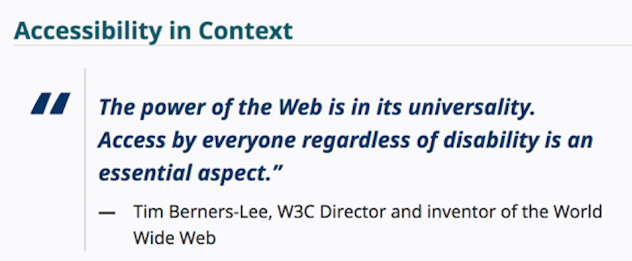

# User experience - UX


**Learning objectives:**


- the key factors for a successful app
- understanding of your audience behavior


## Introduction


This chapter focuses on the key factors for making a **Shiny** app successful.

```{r vs, echo=FALSE, fig.cap="**Shiny** success", out.width=NULL}
DiagrammeR::mermaid("
graph LR
A((The back-yard))-. vs .-> B((the front-end))
  
  style A fill:#f9f
  style B fill:#f96
  
 ",
height = '100%', width = '100%')
```

**The back-yard vs the front-end**

The first take away of this chapter is that thinking about the "behind the scene" of your building app can be challenging for a successful front-end.


## Simplicity is gold


Establish some **rules** about your app to be:

- **simple** the app must be fast usable
- **straightforward** easy to approach and use 


Based on the identification of the **destination** of the app:

- for professional use
- for fun


> The quicker you understand the interface, the better the user experience (in **business**)

> Don't fight against the app but enjoy it (for **fun**)


```{r yesno, echo=FALSE, fig.cap="Yes and No of your app", out.width=NULL}
DiagrammeR::mermaid("
graph LR
A((YES))-. Yes and No of your app .-B((NO))
  
  style A fill:#f9f
  style B fill:#bbf
  
 ",
height = '100%', width = '100%')
```

**Yes**:

- “self-explanatory” but with detailed explanations 
- an efficient tool


**No**:

- fight with interface
- read complex material
- lose time understanding how to use it


Two more important **rules**:

1. “don’t make me think”
2. “rule of least surprise”: **“Principle of Least Astonishment”**


### How we read the web: Scanning content

The second part of this chapter focuses on what your audience is actually seeing about the app.


> The user of your app doesn't read everything, but will be searching for **“How to”?**

```{r howto, echo = FALSE, out.width = NULL, fig.cap = "**“How to”?**"}

DiagrammeR::mermaid("
graph LR
A((scan))-->B>satisfice - satisfy and suffice]
  
  style A fill:#bbf
  style B fill:#f96, stroke:#f66,stroke-width:2px,color:#fff,stroke-dasharray: 5 5
  
  #style P fill:#bbf,stroke:#f66,stroke-width:2px,color:#fff,stroke-dasharray: 5 5

 ",
height = '100%', width = '100%')
```


The user might act unexpectedly on you app

adopt **“defensive programming”** mindset is a workaround the unexpected:

- **inherent logic** in the application: each sub-menu is designed to handle one specific part of your app

- **rational choice**: rationality plays a good game but it is less than expected when up to a new app

- **“irrational” choices**: examine the back-end for unexpected behaviors


> **"organisms adapt well enough to ‘satisfice’; they do not, in general, optimize.“** by Herbert A. Simon


To be **failing gracefully and informatively** can sometimes happen, but do not forget to put an **informative bug message** to avoid a grayish version of the application. Under some conditions you might not have the complete manner of all that is linked with your app (such as widgets in {DT} package)


**Good practices**:

- add a **bug message**
- wrap all server calls (in case of crash reduce the amount of data loss)
- use a **notification function** with {shinyalert} and/or {attempt} packages

As an example, if we want our app to be connected to a database, we use `connect_db()` connection in the `server()`.

If the connection fails, we notify the user: 

```{r eval=FALSE, message=FALSE, warning=FALSE, include=T}
  conn <- attempt::attempt({
    connect_db()
  })
  
  if (attempt::is_try_error(conn)){
    # Notify the user
    send_notification("Could not connect")
  } else {
    # Continue computing if the connection was successful
    continue_computing()
  }
```


### Building a self-evident app (or at least self-explanatory)

- **self-evident**: no demo required
- **self-explanatory**: no explanation required


A. About the **“Rule of Least Surprise”** and the **“Principle of Least Astonishment”**

- various text customization lead to conventional thinking

B. Thinking about progression

- design a clear pattern of moving forward
- hide elements at step n+1 until all the requirements are fulfilled at step n.
- ensure some kind of linear logic through increasing readability 


compare {tidytuesday201942} to {hexmake}


C. Inputs and errors

> Your user is BUSY BUSY BEE ....

In the `UI`:

    useShinyFeedback()

In the `server()`:

    showFeedbackWarning()
    hideFeedback()
 
 
( the notifyjsexample repository link doesn't work )

## The danger of feature-creep

> Rule of Parsimony: Write a big program only when it is clear by demonstration that nothing else will do. 
>                       The Art of UNIX Programming (Raymond 2003)


### What is feature-creep?

The process of adding features to the app that complicate the usage and the maintenance of the product, such as:

- easier navigation
- more information
- more visualizations
- modifiable elements
- ...

**What's behind feature-creep?**

adding more and more things most often leads to:

- a slower app
- worse user experience
- steeper learning curve


### Too much reactivity

- Prevent the implementation of “full reactivity”

This is a very important part of how to make an app working smoothly, releasing the best experience to users.

The book reminds that: **people make mistakes** while using the app 

> be sure your app doesn't update all the times at any given imputs 

If the application reacts to all of the moves, the experience using the app can be bad, imagine that all the elements on the app update at any user input

The best solution is to add **one reactive button** to give the user the opportunity to update results once all the changes have been made.


### Too much interactivity


**A. Speed:** use the features that assure fast visualizations at a given input

**B. Visual noise:** reduce the numbers of extra features 


## Web accessibility

### About accessibility

Audience: large audience

```{r accessibilityimage,echo=FALSE, fig.align='center', fig.cap='Accessibility in Context', out.width='100%'}

```


### Making your app accessible


**A. Hierarchy:** respect the order of importance

**B. HTML element:** Semantic tags, and tag metadata:

- without “meanings”:

      <div> or <span>

- have a specific “meanings”: meaningful (Semantic tags)

      <title> or <article>
      <address>, <video>, or <label>

- metadata

      alt we can use the tagAppendAttributes()

```{r eval=FALSE, include=T}

ui <- function(){
  
  tagList(
    plotOutput("plot") %>% 
      # Adding the `alt` attribute to our plot
      tagAppendAttributes(alt = "Plot of iris")
  )
}
```

It will be crucial to **screen-to-speech technology**: the software will read the `<title>` tag, jump to the `<nav>`, or straight to the `<article> on the page. 
 
**C. Navigation:** make everything doable with a keyboard

      textInput() with a validation button and {nter} package


```{r eval=FALSE, include=T}
# Adapted from https://github.com/JohnCoene/nter
library(nter)
library(shiny)

ui <- fluidPage(
  # Setting a text input and a button
  textInput("text", ""),
  # This button will be clicked when 'Enter' is pressed in 
  # the textInput text
  actionButton("send", "Do not click hit enter"),
  verbatimTextOutput("typed"),
  # define the rule
  nter("send", "text") 
)

server <- function(input, output) {
  
  r <- reactiveValues()
  
  # Define the behavior on click
  observeEvent( input$send , {
    r$printed <- input$text
  })
  
  # Render the text
  output$typed <- renderPrint({
    r$printed
  })
}

shinyApp(ui, server)
```


**D. Color choices:** recommended to use provided color composition such as **viridis** or other specific combinations.

Here as an example is the build of a function, but other packages can be used such as {dichromat} packages which simulates color blindness.

```{r}
with_palette <- function(palette) {
  x <- y <- seq(-8 * pi, 8 * pi, len = 40)
  r <- sqrt(outer(x^2, y^2, "+"))
  z <- cos(r^2) * exp(-r / (2 * pi))
  filled.contour(
    z,
    axes = FALSE,
    color.palette = palette,
    asp = 1
  )
}

with_palette(matlab::jet.colors)
```


### Evaluating your app accessibility and further reading

How to evaluate accessibility?

**A.** Emulate vision deficiency using Google Chrome

**B.** External tools


## References

- [shinyalert](https://github.com/daattali/shinyalert)
- [Hexmake app](https://github.com/colinfay/hexmake)
- [Accessibility](https://www.w3.org/WAI/fundamentals/accessibility-intro/)
- [Freecodecamp - tutorial](https://www.freecodecamp.org/learn/)
- [nter package](https://github.com/JohnCoene/nter)
- [Color blindness](https://www.colourblindawareness.org/)


## Meeting Videos

### Cohort 1

`r knitr::include_url("https://www.youtube.com/embed/ZvwWVEdT5VI")`

<details>
  <summary> Meeting chat log </summary>
```
00:07:13	Ryan Metcalf:	So sorry for my delay in joining team!
00:07:25	Federica Gazzelloni:	All good
00:07:41	Federica Gazzelloni:	Hello
00:10:03	Russ Hyde:	https://r4ds.github.io/bookclub-epgs/
00:33:34	Ryan Metcalf:	https://databank.worldbank.org/source/education-statistics-%5e-all-indicators
00:34:25	Ryan Metcalf:	I’m using education as an example of Dataset. I’m referring to the construction of a query to display. LOTS to choose from. To an unfamiliar user, this site is difficult to navigate and produce meaningful results.
00:34:59	Russ Hyde:	I think the notifyjs exmaple was moved here; https://github.com/ColinFay/golemexamples/tree/master/golemnotifyjs
00:49:06	Federica Gazzelloni:	https://connect.thinkr.fr/hexmake/
01:02:53	Federica Gazzelloni:	thanks Ryan
```
</details>
