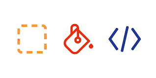
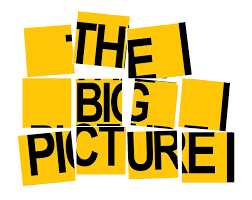
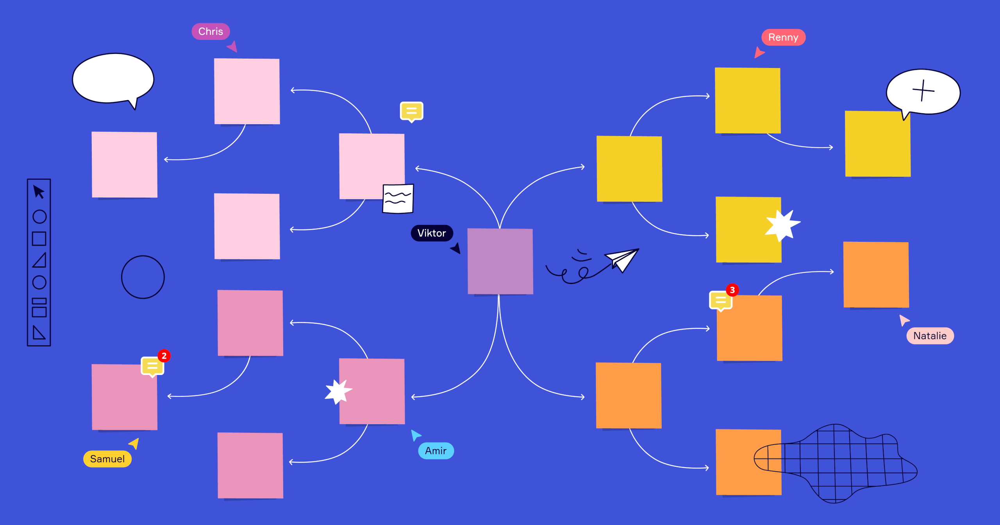
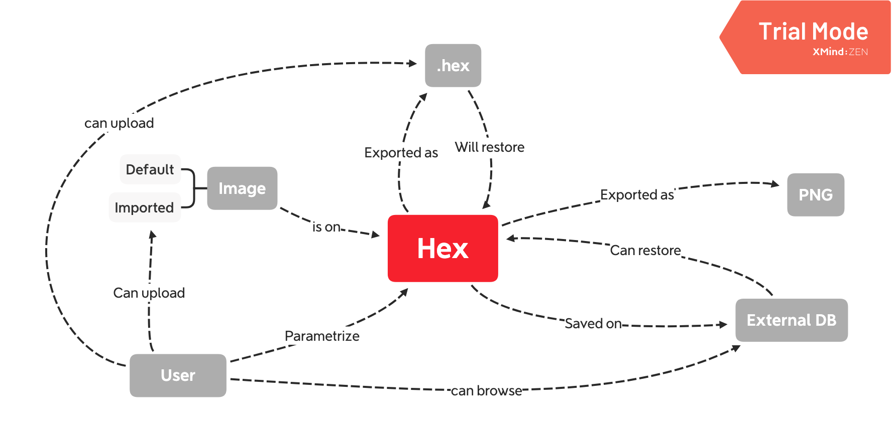

# Developer patience - Don't rush into coding


**Learning objectives:**

- thinking about the Big Picture
- building Personas
- the IT side of your application

## Designing before coding

```{r design,echo=FALSE, fig.align='center', fig.cap='[Designing before coding: credits](https://matthewstrom.com/writing/designing-with-code.html)', out.width='50%'}

```


### The urge to code

- technical implementation: search for an existent soultion
- packages
- pieces of code
- ...

```{r bigpicture,echo=FALSE, fig.align='center', fig.cap='[The Big Picture credits](http://onthemark.ca/big-picture/)', out.width='50%'}

```

Thinking about the Big Picture helps in designing your app:

- what are the inputs
- what are the outputs
- what packages/services can you use inside your application
- how will it fit in the rest of the project
- ...

### Knowing where to search

- R and {shiny} [resources](https://engineering-shiny.org/dont-rush-into-coding.html) 
- Web [resources](https://engineering-shiny.org/dont-rush-into-coding.html) 

### About concept map

> take a piece of paper and draw all the concepts, and all the relationships that link these concepts together.

```{r conceptmap,echo=FALSE, fig.align='center', fig.cap='[The Concept Map credits](https://miro.com/blog/how-to-make-a-concept-map/)', out.width='50%'}

```

```{r hexmakemap,echo=FALSE, fig.align='center', fig.cap='[The HexmakeMap credits](https://engineering-shiny.org/dont-rush-into-coding.html)', out.width='50%'}

```

- Can we point to any concept and confirm it’s there?

- Can we look at every relationship and see they all work as expected?

## Ask questions


```{r askquestions,echo=FALSE, fig.align='center', fig.cap='[Ask questions credits](https://englishlive.ef.com/blog/language-lab/question-words/)', out.width='50%'}
knitr::include_graphics("images/07-askquestions.jpg")
```


### About the end users

1. Who are the end users of your app?

2. Are they tech-literate?

3. In which context will they be using your app?

4. On what machines (computer, tablet, smartphone, or any other device)?

5. Are there any restrictions when it comes to the browser they are using? (For example, are they still using an old version of Internet Explorer?)

6. Will they be using the app in their office, on their phone while driving a tractor, in a plant, or while wearing a lab coat?

**Some more:**

7. Do the users really need that much interactive plots? 

8. Do they actually need that much granularity in the information? 

9. Will they really see a datatable of 15k lines? 

10. Do they really care about being able to zoom in the dygraph so that they can see the point at a minute scale? 

11. To what extent does the app have to be fast?


### Building personas

Helps you focusing on the end user and the “typical” behavior and traits for a group of users.

```{r personas,echo=FALSE, fig.align='center', fig.cap='[Get a feeling of its personality credits](https://www.buzzfeed.com/garfgarfff/this-quiz-will-tell-you-which-three-fictional-char-22hv8)', out.width='50%'}
knitr::include_graphics("images/07-personas.jpg")
```

- Will they use it? 
- Will they understand it? 
- Do we need to add extra information? 
- Will they find this useful?


### Pre-existing code-base

- “brownfield projects”: existing code-base
- “greenfield projects”: start from scratch

### Deployment

- deploying with Docker: a container on your machine
- IT side of your application

Here is a nice story:

> Once deployed, the app stopped working, and the team lost a couple of days of exchanges with the client, trying to debug the API calls, until we realized that the issue was not with the app, but with the production server itself: and nobody in the team, not the developers or the client, thought about asking about internet access for the server.


