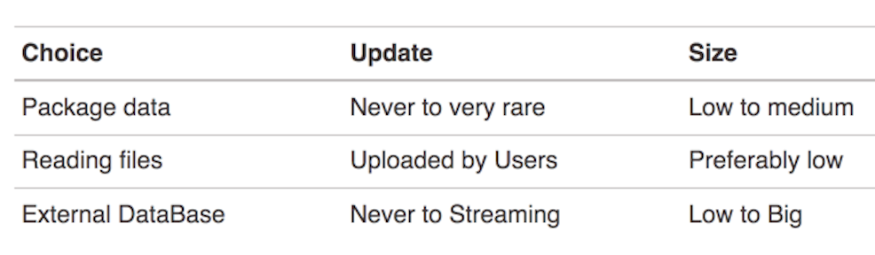

# Optimazing Shiny - Common Application Caveats

**Learning Objectives**

- Decide what should be optimized.
- Compare app versions to optimize an app.
- Read data into your Shiny application.

## Introduction

This chapter focuses on how to optimize common applications when using Shiny.

Several versions of the same app are compared to achieve shorter and more understandable structures as well as more stable renderings.


## Reactivity anti-patterns


> A invalidates B which invalidates C which invalidates A which invalidates B which invalidates C, and so on...

```{r 15-reactivity,echo=FALSE, fig.align='center', fig.cap='[Reactivity an overview](https://shiny.rstudio.com/articles/reactivity-overview.html)', out.width='80%'}
knitr::include_graphics("images/15-reactivity.png")
```

Too much **reactivity** can lead to recursive behaviors.

How to handle it:

- example app
- set specific steps 
- let the user choose by step

For example in the case of selecting dates:

`dateInput()` and the `selectInput()` updates each other (cac_1)

One way to solve this is to **add some extra logic** to the app by:

`selectInput()` and adding an the `observeEvent(input$year, {})` (cac_2)


### observe vs observeEvent

The main guideline is to use `observeEvent()` as much as possible, and avoid `observe()`as much as possible.


Looking at the steps taken for building this first example app, we see that changing the text input doesn't make any difference, but if we add the "reverse" opting, we can see the recursive taking action.

In this example we use `obeserve()`: (cac_3)

```{r 15-recursive,echo=FALSE, fig.align='center', fig.cap='Recursivity', out.width='80%'}

```

How many potential invalidation points we have here?

- `input$txt`
- `input$rev`
- `input$casefolding`


It is safer to go with `observeEvent()`, as it allows you to see at a glance the condition under which the content is invalidated and re-evaluated.

```{r 15-observe,echo=FALSE, fig.align='center', fig.cap='Recursivity', out.width='80%'}

```


### Building triggers and watchers

- create “flag” objects with an `init` function
- trigg these flags with `trigger()`
- invalidate these flags to a reactive context, we `watch()` these flags

To solve this kind of issues, ColinFay provides a package:
[gargoyle package](https://github.com/ColinFay/gargoyle) that provides wrappers around {shiny} to turn your app into and **event-based application** instead of a full reactive app. 

> The framework is centered around a **listen & trigger** mechanism.

```{r eval=FALSE, include=T}
# CRAN version 
# install.pacKages("gargoyle")
# Dev version
# remotes::install_github("ColinFay/gargoyle")
```


- `gargoyle::init("this")` initiates a "this" flag: most of the time you will be generating them at the app_server() level.

- `gargoyle::watch("this")` sets the flag inside a reactive context, so that it will be invalidated every time you trigger("this") this flag.

- `gargoyle::trigger("this") triggers the flags.


(Example of the implemented structure: [{hexmake}](https://github.com/colinfay/hexmake) ([Fay 2021g](https://engineering-shiny.org/references.html#ref-R-hexmake)))

A practical example of the implementation uses an environment to store the value.

So, do not rely on any reactive value invalidating the reactive context, but the result is rendered on when "render2" flag is triggered. (cac_4)

## Using R6 as data storage

The idea is to storage the R functional framework inside an R6 class.

R6 is an encapsulated object-oriented programming (OOP) framework, a programming language used to construct the modular pieces of code that can be used to build blocks for large systems. It is used to structure a software program into simple, reusable pieces of code blueprints (classes) to create individual instances (objects). R is a functional programming language which uses R6 object-oriented programming-OOP.

1. Sharing data across modules (field/class)
2. Be sure it is tested (object)

- [R6](https://cran.r-project.org/web/packages/R6/index.html)
- [R6 Advanced R](https://adv-r.hadley.nz/r6.html)
- [R6 classes](https://r6.r-lib.org/articles/Introduction.html)

 (cac_5)
 
```{r 15-MyData}
MyData <- R6::R6Class(
  "MyData", 
  # Defining our public methods, that will be 
  # the dataset container, and a summary function
  public = list(
    data = NULL,
    initialize = function(data){
      self$data <- data
    }, 
    summarize = function(){
      summary(self$data)
    }
  )
)
```


```{r 15-testthat}
library(testthat, warn.conflicts = FALSE)
```


```{r 15-testing}
test_that("R6 Class works", {
  # We define a new instance of this class, that will contain 
  # the mtcars data.frame
  my_data <- MyData$new(mtcars)
  # We will expect my_data to have two classes: 
  # "MyData" and "R6"
  expect_is(my_data, "MyData")
  expect_is(my_data, "R6")
  # And the summarize method to return a table
  expect_is(my_data$summarize(), "table")
  # We would expect the data contained in the object 
  # to match the one taken as input to new()
  expect_equal(my_data$data, mtcars)
  # And the summarize method to be equal to the summary()
  #  on the input object
  expect_equal(my_data$summarize(), summary(mtcars))
})
```


## Logging reactivity with {whereami}


### What is logging? - What is a **reactive logging**?

Logging is a way to access the **log file** of the app.
It is used to debug the app's code, and it is a useful feature when debugging someone else's code.
The log file is where all the steps taken by the app are registered, it tells you what your app is doing.
So that, being able to access the log file and locate the part that is to be debugged is an important task. 
To facilitate the location of the "part of the shiny code that is to be debugged" a **warning** is positioned for simplification of the procedure.

There are several packages in R that provide useful functions for **logging**, here we talk about some specific packages to use within a shiny app.

....**whereami** is one of them.

[{whereami}](https://rdrr.io/pkg/whereami/man/whereami.html) return where the script is run from

```{r 15-whereami,echo=FALSE, fig.align='center', fig.cap='{whereami} package', fig.alt="{whereami}",out.width='30%'}

```

      whereami::whereami()
      
(Sidi and Müller 2019 - [github](https://github.com/yonicd/whereami) )
   

For example, `whereami()` function let's you locate the name of the file you are working on:
```{r 15-library-whereami}
library(whereami)
whereami::whereami()
```

Then, as classical procedure, with the use of the `base::cat()` function within the **logging** procedure, the `cat_where()` function in **{whereami}** package, helps you to producing an output in a user-defined function. It converts arguments to character vectors and, concatenates them to a single character vector, in the locate file.


**Where should it be located?**

If it is added to the `app_server()`, it will print the location of the function call to the logs.      

The combination with `cat_where()` will implement a reactive logging to the console while developing or debugging an app.
```{r 15-cat_where, eval=FALSE, message=FALSE, warning=FALSE, include=T, paged.print=FALSE}
whereami::cat_where( whereami::whereami() )
```


```{r 15-cat_where2, eval=FALSE, include=T}
cat_where(where, 
          type = c("rule", "boxx", "bullet", "line", "print"),
          color = "some_colors", 
          ...)
```

Another feature is to get a list of all the *counters*: the numbers of time each of the located *cat* functions have been called and plot the statistics of the usage.

```{r 15-cat_where_counter_plot, eval=FALSE, include=T}
whereami::counter_get()
plot(whereami::counter_get())
```
      
```{r 15-counterplot,echo=FALSE, fig.align='center', fig.cap='{whereami} package', fig.alt="plot of whereami counters",out.width='80%'}

```     
      
      
**As an example:**

```{r 15-another-plot, message=FALSE, warning=FALSE, paged.print=FALSE}
library(whereami)
require(ggplot2)
ggplot(iris) + 
  aes(x=Sepal.Length,y=Sepal.Width) + 
  geom_point() + 
  labs(caption = sprintf('sourced from: %s',whereami()))
```


In this context, it is everything we need to know about **logging** with **whereami**. 

More information about in general *logging* a shiny app can be found here: [blog.sellorm.com](https://blog.sellorm.com/2021/06/16/getting-started-with-logging-in-r/)


## R does too much

### Rendering the UI from the server side

Change things on the UI based on what happens in the server:

**A.** **Implement UI events in JavaScript**
Adding JavaScript elements would speed up the process, as well as substituting `uiOutput()` and `renderUI()` with more direct functions, for example if requested is a text use: `textOutput("...")` instead of the whole **uiOutput()**. 
And in the server  `renderText(...)` instead of `renderUI()`.

(compare cac_6 to cac_7)


**B.** **update* inputs**
Same as using  `selectInput(...)` and  `updateSelectInput(...)`

**C.** **insertUI and removeUI**
Dynamically change what is in the UI is with `insertUI()` and `removeUI()`


To make the code simpler for the developer and to make an app which is easier to use from a user perspective, there are some strategies that suggest to avoid some common functions, such as: `uiOutput()` and `renderUI()`.

In general what is happening is that we change things on the UI based on what happens in the server, and **for making R not regenerate the whole UI component** but only changing what is needed, we can:


### Too much data in memory

Consider deporting the data handling and computation to an external database system: for example, to an SQL database.


## Reading data


### Reading external datasets

To include data inside your application: 

        usethis::use_data_raw( name = "my_dataset", open = FALSE ) command
        usethis::use_data(my_dataset)


### Including data in your application

To upload data inside your application:

        shiny::fileInput()
        
### Using external databases

To include data from external databases use:

- SQL databases designed to store tabular data
- NoSQL database like MongoDB to write operations, and store any kind of object


Example of an app that uses on an external database is `{databasedemo}`, available at [engineering-shiny](http://engineering-shiny.org/databasedemo/)


### Data-source checklist

```{r 15-sources,echo=FALSE, fig.align='center', fig.cap='Data-source checklist', out.width='80%'}

```

## Conclusions

In conclusion, there are some different ways to optimize an app using extrafeatures such as packages that let you identify the location of the most used part of the app for an easier debugging procedure. Also, to be at knowledge of the tools for uploading and/or deploying external data into the app would require extra consideration of the amount of memory taken for doing the job.

### Resources

- [Reactivity an overview](https://shiny.rstudio.com/articles/reactivity-overview.html)
- [blog.sellorm.com](https://blog.sellorm.com/2021/06/16/getting-started-with-logging-in-r/)
- [whereami](https://github.com/yonicd/whereami)


## Meeting Videos

### Cohort 1

`r knitr::include_url("https://www.youtube.com/embed/JkacZOrB1QY")`

<details>
  <summary> Meeting chat log (2021-12-01) </summary>
```
00:06:09	Ryan Metcalf:	https://adventofcode.com/
```
</details>

`r knitr::include_url("https://www.youtube.com/embed/5wL02PXgQiY")`
